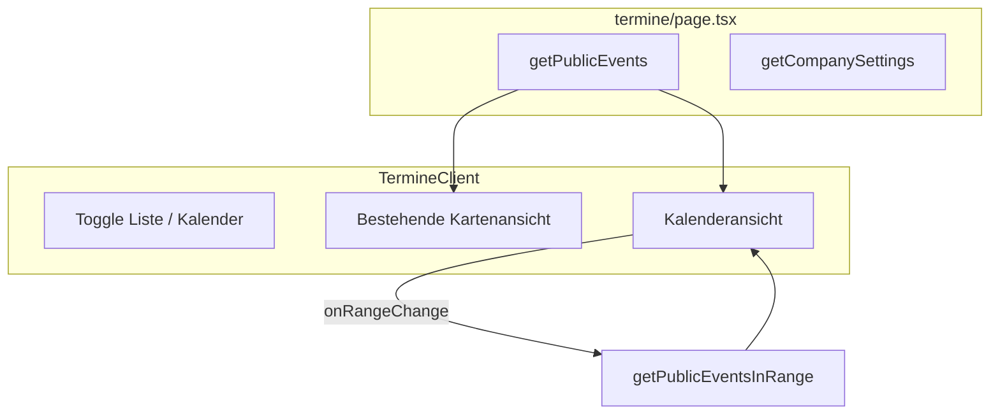

# Termine: Listenansicht und öffentlicher Veranstaltungskalender

## Ausgangslage

Die Seite [/termine](src/app/termine/page.tsx) zeigt aktuell Veranstaltungen gruppiert nach Event-Name (z.B. „Wohnzimmergespräche“) mit Termin-Instanzen, Beschreibung, Ort und Anmeldung. **Diese chronologische Kartenansicht bleibt unverändert.**

**Neu:** Ein öffentlicher Veranstaltungskalender wird ergänzt, mit Toggle zwischen beiden Ansichten.

**Bestehende Infrastruktur:**

- [TermineClient.tsx](src/components/public/TermineClient.tsx) – gruppierte Kartenansicht (bleibt)
- [CalendarView.tsx](src/components/admin/CalendarView.tsx) – nutzt bereits `react-big-calendar` und `EventInstance[]`
- [events.ts](src/app/actions/events.ts) – `getPublicEvents()` mit `eventsDisplayMode`/`eventsDisplayLimit`
- `EventInstance` aus [recurrence.ts](src/lib/recurrence.ts)

## Architektur




## Implementierung

### 1. Server Action für Kalender-Daten

Neue Funktion in [src/app/actions/events.ts](src/app/actions/events.ts):

```ts
export async function getPublicEventsInRange(from: Date, to: Date): Promise<EventInstance[]>
```

- Lädt nur öffentliche Events (`is_public = true`)
- Expandiert Serien via `expandRecurringEvents(events, from, to)`
- **Kein** `eventsDisplayLimit` – Kalender braucht alle Events im sichtbaren Zeitraum

### 2. PublicCalendar-Komponente

Neue Datei: `src/components/public/PublicCalendar.tsx`

- Nutzt `react-big-calendar` (bereits in package.json)
- Nur Veranstaltungen
- Views: `month`, `week`, `agenda`
- Deutsche Lokalisierung (`date-fns/locale/de`)
- Bei `onRangeChange` Server Action `getPublicEventsInRange` aufrufen
- Klick auf Event: Modal mit Name, Datum, Ort, ICS-Link, Anmelde-Button
- Styling: emerald/stone passend zur öffentlichen Seite

### 3. Erweiterung TermineClient

- **Toggle** oben: „Liste“ | „Kalender“
- **Listenansicht:** Bestehende gruppierte Kartenansicht unverändert übernehmen
- **Kalenderansicht:** PublicCalendar einbinden

## Betroffene Dateien


| Datei                                      | Änderung                                          |
| ------------------------------------------ | ------------------------------------------------- |
| `src/app/actions/events.ts`                | `getPublicEventsInRange(from, to)` hinzufügen     |
| `src/components/public/PublicCalendar.tsx` | Neu – Kalender mit react-big-calendar             |
| `src/components/public/TermineClient.tsx`  | Toggle Liste/Kalender, PublicCalendar integrieren |


