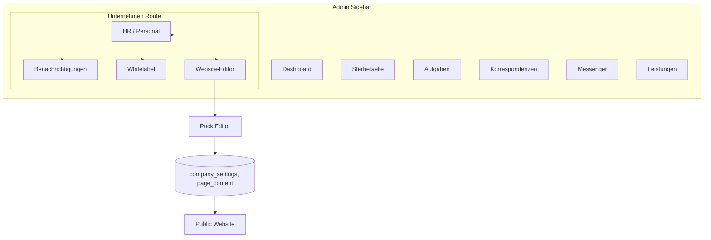

# Unternehmen-Bereich und Visual Page Builder

## 1. Kontext und Ziel

- **Sidebar:** "Benachrichtigungen" entfernen (gehört nicht in die Sidebar)
- **Sidebar:** "HR / Personal" umbenennen zu "Unternehmen"
- **Unter "Unternehmen":** Zentraler Bereich mit:
  - HR / Personal (Mitarbeiter, Rechte, E-Mail-Konten)
  - Benachrichtigungen (Telegram, E-Mail, WhatsApp)
  - Whitelabel (Anzeigename, Styles)
  - Website-Editor (flexible Steuerung der Public-Website)

## 2. Architektur-Übersicht




## 3. Recherche: Visual Page Builder


| Bibliothek | Stars | Lizenz   | Next.js     | Empfehlung                                                   |
| ---------- | ----- | -------- | ----------- | ------------------------------------------------------------ |
| **Puck**   | ~12k  | MIT      | Ja (Recipe) | **Empfohlen** – React-first, JSON-Modell, eigene Komponenten |
| Composify  | ~230  | MIT      | Ja          | Alternative – JSX-Output                                     |
| Easyblocks | ~418  | AGPL-3.0 | Ja          | Lizenzproblem für kommerzielle Nutzung                       |
| Designful  | -     | -        | -           | Figma-Style, eher Design-Tool                                |


**Puck** ([puckeditor/puck](https://github.com/puckeditor/puck)) passt am besten:

- MIT-Lizenz
- `npm i @puckeditor/core`
- Eigene React-Komponenten als Blöcke
- JSON-Datenmodell → Speicherung in Supabase
- [Next.js Recipe](https://github.com/puckeditor/puck/tree/main/recipes/next) vorhanden

## 4. Implementierungsplan

### Phase 1: Sidebar und Routing

**Dateien:** [src/components/admin/AdminShell.tsx](src/components/admin/AdminShell.tsx), [src/components/admin/AdminShellLayout.tsx](src/components/admin/AdminShellLayout.tsx)

- "Benachrichtigungen"-Nav-Item entfernen
- "HR / Personal" zu "Unternehmen" umbenennen
- Link von `/admin/dashboard` auf `/admin/unternehmen` ändern (neue Route)
- Tab-Typ `employees` und `settings` durch `unternehmen` ersetzen (oder beibehalten für Fallback)

### Phase 2: Unternehmen-Route mit Sub-Navigation

**Neue Struktur:**

```
/admin/unternehmen/
  page.tsx          → Redirect auf /admin/unternehmen/personal
  layout.tsx        → Sub-Nav: Personal | Benachrichtigungen | Whitelabel | Website
  personal/page.tsx → EmployeeManagement
  benachrichtigungen/page.tsx → NotificationSetupWizard
  whitelabel/page.tsx → CompanySettings (neu)
  website/page.tsx → Puck-basierter Page Builder (neu)
```

**Dateien:**

- `src/app/admin/unternehmen/layout.tsx` – Layout mit Sub-Navigation (ähnlich [LeistungenTabNav](src/components/admin/LeistungenTabNav.tsx))
- `src/app/admin/unternehmen/personal/page.tsx` – `EmployeeManagement` einbinden
- `src/app/admin/unternehmen/benachrichtigungen/page.tsx` – `NotificationSetupWizard` einbinden
- `src/app/admin/unternehmen/whitelabel/page.tsx` – Whitelabel-Formular
- `src/app/admin/unternehmen/website/page.tsx` – Puck-Editor

### Phase 3: Whitelabel-Datenmodell

**Migration:** `supabase/migrations/YYYYMMDD_company_settings.sql`

```sql
create table public.company_settings (
  key text primary key,
  value jsonb not null default '{}',
  updated_at timestamptz default now() not null
);
-- Keys: display_name, tagline, primary_color, secondary_color, logo_url, favicon_url, ...
```

**Actions:** `src/app/actions/company-settings.ts` – `getCompanySettings()`, `saveCompanySettings()`

**Whitelabel-Komponente:** Formular für Anzeigename, Primärfarbe, Sekundärfarbe, Logo-URL, ggf. Favicon.

### Phase 4: Puck-Integration für Website-Editor

**Abhängigkeit:** `@puckeditor/core`

**Puck-Konfiguration:**

- Eigene Blöcke für die bestehenden Sektionen: Hero, Philosophie-Karten, Leistungen, Footer, Kontakt
- Blöcke aus [src/app/page.tsx](src/app/page.tsx) ableiten (Hero, Philosophie, Leistungen, Footer)
- Speicherung: JSON in `company_settings` unter Key `page_content` oder eigene Tabelle `page_content`

**Dateien:**

- `src/components/admin/WebsiteEditor.tsx` – Puck-Editor mit Config
- `src/components/admin/puck-config.ts` – Komponenten-Registry und Config
- `src/app/admin/unternehmen/website/page.tsx` – Lädt/Speichert Page-Content, rendert Editor

### Phase 5: Public Page dynamisch machen

**Dateien:** [src/app/page.tsx](src/app/page.tsx), [src/components/public/Navbar.tsx](src/components/public/Navbar.tsx)

- `page.tsx`: Statt hardcodierter Inhalte `Render` von Puck mit gespeichertem JSON verwenden
- Fallback: Wenn kein Page-Content existiert, aktuellen hardcodierten Inhalt anzeigen
- Navbar: Anzeigename und Styles aus `company_settings` lesen (z.B. via React Context oder Server-Fetch)

### Phase 6: Admin-Dashboard bereinigen

**Dateien:** [src/components/admin/AdminDashboardClient.tsx](src/components/admin/AdminDashboardClient.tsx)

- Tabs `employees` und `settings` entfernen (Inhalte liegen jetzt unter `/admin/unternehmen/...`)
- Keine Anpassung nötig, wenn Unternehmen als eigener Link geführt wird und nicht mehr als Dashboard-Tab

## 5. Wichtige Code-Referenzen


| Bereich             | Datei                                                                           | Relevanz                        |
| ------------------- | ------------------------------------------------------------------------------- | ------------------------------- |
| Sidebar-Nav         | [AdminShell.tsx](src/components/admin/AdminShell.tsx) L167–207                  | Nav-Items anpassen              |
| Tab-Kontext         | [AdminShellLayout.tsx](src/components/admin/AdminShellLayout.tsx)               | TabType erweitern/ändern        |
| Sub-Nav-Beispiel    | [LeistungenTabNav.tsx](src/components/admin/LeistungenTabNav.tsx)               | Vorlage für Unternehmen-Sub-Nav |
| Public Page         | [page.tsx](src/app/page.tsx)                                                    | Sektionen als Puck-Blöcke       |
| Notification-Setup  | [NotificationSetupWizard.tsx](src/components/admin/NotificationSetupWizard.tsx) | Unverändert unter Unternehmen   |
| Employee-Management | [EmployeeManagement.tsx](src/components/admin/EmployeeManagement.tsx)           | Unverändert unter Unternehmen   |


## 6. Offene Punkte / Klärungsbedarf

1. **Multi-Tenant:** Soll das System mehrere Unternehmen (Tenants) unterstützen oder nur ein Unternehmen pro Installation?
2. **Editor-Umfang:** Sollen alle Sektionen (Hero, Philosophie, Leistungen, Footer) editierbar sein oder zunächst nur Texte und Bilder?
3. **Rollout:** Soll die dynamische Public Page schrittweise kommen (z.B. erst Whitelabel, dann Editor) oder in einem Schritt?

